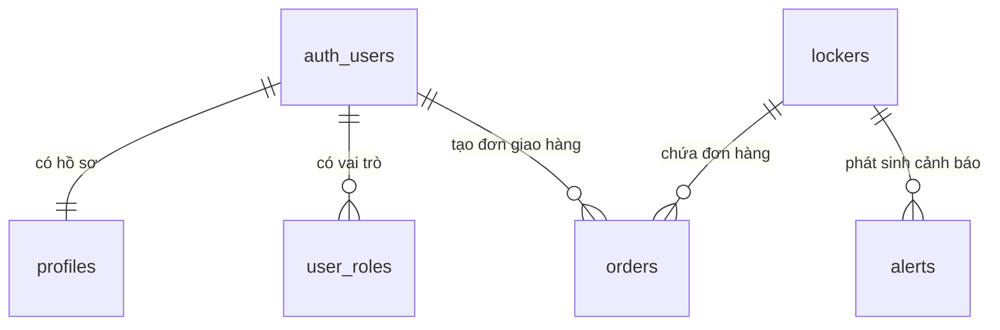

# Thiết kế Database - Smart Locker Hub

Tài liệu này mô tả thiết kế database của dự án Smart Locker Hub. Database đang dùng là **Supabase PostgreSQL**.

Schema thực tế nằm trong các file migration tại:

- `supabase/migrations/20260506043111_3e780c1a-130f-4c7d-a9be-dbecfc9c7e9f.sql`
- `supabase/migrations/20260506043139_cf6ed52d-081c-4d9a-846b-0280fa8f07a0.sql`

## Tổng quan

Ứng dụng không có backend riêng. Frontend React kết nối trực tiếp tới Supabase để sử dụng:

| Thành phần | Vai trò |
| --- | --- |
| Supabase Auth | Đăng ký, đăng nhập và quản lý tài khoản nhân viên |
| PostgreSQL | Lưu dữ liệu tủ, đơn hàng, phân quyền, cấu hình và cảnh báo |
| Row Level Security | Giới hạn quyền đọc/ghi dữ liệu theo vai trò |
| RPC Functions | Cung cấp API tra cứu đơn hàng và xác minh OTP |
| Supabase Realtime | Cập nhật trạng thái tủ, đơn hàng và cảnh báo theo thời gian thực |

## Sơ đồ quan hệ tổng quát

## Danh sách bảng

| Bảng | Mục đích |
| --- | --- |
| `auth.users` | Bảng hệ thống của Supabase Auth, lưu tài khoản đăng nhập |
| `profiles` | Lưu thông tin mở rộng của người dùng |
| `user_roles` | Lưu vai trò của người dùng: admin hoặc shipper |
| `lockers` | Lưu danh sách và trạng thái các tủ locker |
| `settings` | Lưu cấu hình phí và thông tin tài khoản nhận thanh toán |
| `orders` | Lưu đơn gửi hàng trong tủ |
| `alerts` | Lưu cảnh báo hệ thống |

## Chi tiết từng bảng

### 1. `auth.users`

Đây là bảng hệ thống do Supabase Auth quản lý. Dự án không tự tạo bảng này trong migration.

| Thuộc tính | Kiểu dữ liệu | Ràng buộc | Mô tả |
| --- | --- | --- | --- |
| `id` | `uuid` | Primary key | ID người dùng, được dùng làm khóa ngoại ở các bảng khác |
| `email` | `text` | Unique | Email đăng nhập |
| `created_at` | `timestamptz` |  | Thời điểm tạo tài khoản |

Ghi chú:

- Khi user mới được tạo trong `auth.users`, trigger `handle_new_user()` sẽ tự tạo dữ liệu tương ứng trong `profiles` và `user_roles`.

### 2. `profiles`

Bảng lưu thông tin hồ sơ mở rộng của người dùng.

| Thuộc tính | Kiểu dữ liệu | Ràng buộc | Mô tả |
| --- | --- | --- | --- |
| `id` | `uuid` | Primary key, Foreign key tới `auth.users(id)` | ID người dùng |
| `display_name` | `text` | Nullable | Tên hiển thị |
| `phone` | `text` | Nullable | Số điện thoại của người dùng |
| `created_at` | `timestamptz` | Not null, default `now()` | Thời điểm tạo hồ sơ |

Quan hệ:

| Quan hệ | Mô tả |
| --- | --- |
| `profiles.id` → `auth.users.id` | Mỗi user có một hồ sơ |

### 3. `user_roles`

Bảng lưu vai trò của người dùng trong hệ thống.

| Thuộc tính | Kiểu dữ liệu | Ràng buộc | Mô tả |
| --- | --- | --- | --- |
| `id` | `uuid` | Primary key, default `gen_random_uuid()` | ID của bản ghi phân quyền |
| `user_id` | `uuid` | Not null, Foreign key tới `auth.users(id)` | Người dùng được gán vai trò |
| `role` | `app_role` | Not null | Vai trò của user: `admin` hoặc `shipper` |
| `created_at` | `timestamptz` | Not null, default `now()` | Thời điểm gán vai trò |

Ràng buộc:

| Ràng buộc | Mô tả |
| --- | --- |
| `unique(user_id, role)` | Một user không thể bị gán trùng cùng một vai trò |

Quan hệ:

| Quan hệ | Mô tả |
| --- | --- |
| `user_roles.user_id` → `auth.users.id` | Một user có thể có nhiều vai trò |

Vai trò hiện có:

| Role | Ý nghĩa |
| --- | --- |
| `admin` | Quản trị viên, có quyền quản lý toàn bộ hệ thống |
| `shipper` | Nhân viên giao hàng, có quyền tạo đơn và thao tác với tủ |

### 4. `lockers`

Bảng lưu danh sách các tủ locker vật lý.

| Thuộc tính | Kiểu dữ liệu | Ràng buộc | Mô tả |
| --- | --- | --- | --- |
| `id` | `integer` | Primary key | Mã số tủ |
| `status` | `text` | Not null, default `empty` | Trạng thái tủ |
| `updated_at` | `timestamptz` | Not null, default `now()` | Thời điểm cập nhật gần nhất |

Giá trị `status` đang dùng:

| Giá trị | Ý nghĩa |
| --- | --- |
| `empty` | Tủ đang trống |
| `occupied` | Tủ đang có hàng |
| `overdue` | Tủ có đơn quá hạn |

Dữ liệu mặc định:

| `id` | `status` |
| --- | --- |
| `1` | `empty` |
| `2` | `empty` |

Quan hệ:

| Quan hệ | Mô tả |
| --- | --- |
| `orders.box_id` → `lockers.id` | Một tủ có thể phát sinh nhiều đơn hàng theo thời gian |
| `alerts.box_id` → `lockers.id` | Một tủ có thể phát sinh nhiều cảnh báo |

### 5. `settings`

Bảng lưu cấu hình hệ thống. Đây là bảng singleton, chỉ có một dòng với `id = 1`.

| Thuộc tính | Kiểu dữ liệu | Ràng buộc | Mặc định | Mô tả |
| --- | --- | --- | --- | --- |
| `id` | `integer` | Primary key, check `id = 1` | `1` | ID cấu hình |
| `base_fee` | `integer` | Not null | `3000` | Phí cơ bản |
| `base_hours` | `integer` | Not null | `24` | Số giờ được tính trong phí cơ bản |
| `overdue_fee` | `integer` | Not null | `2000` | Phí quá hạn cho mỗi block |
| `overdue_hours` | `integer` | Not null | `12` | Số giờ của mỗi block quá hạn |
| `bank_account` | `text` | Nullable | `0123456789` | Số tài khoản nhận thanh toán |
| `bank_code` | `text` | Nullable | `VCB` | Mã ngân hàng dùng để tạo VietQR |
| `account_name` | `text` | Nullable | `SMART LOCKER` | Tên chủ tài khoản |
| `updated_at` | `timestamptz` | Not null | `now()` | Thời điểm cập nhật cấu hình |

Ràng buộc:

| Ràng buộc | Mô tả |
| --- | --- |
| `settings_singleton check (id = 1)` | Đảm bảo bảng chỉ dùng một dòng cấu hình duy nhất |

### 6. `orders`

Bảng lưu đơn gửi hàng trong tủ locker.

| Thuộc tính | Kiểu dữ liệu | Ràng buộc | Mô tả |
| --- | --- | --- | --- |
| `id` | `uuid` | Primary key, default `gen_random_uuid()` | ID đơn hàng |
| `box_id` | `integer` | Not null, Foreign key tới `lockers(id)` | Tủ chứa hàng |
| `otp_code` | `text` | Not null | Mã OTP để người nhận mở tủ |
| `user_phone` | `text` | Not null | Số điện thoại người nhận |
| `shipper_id` | `uuid` | Foreign key tới `auth.users(id)` | Shipper tạo đơn |
| `start_time` | `timestamptz` | Not null, default `now()` | Thời điểm bắt đầu gửi hàng |
| `picked_up_at` | `timestamptz` | Nullable | Thời điểm người nhận lấy hàng hoặc admin hoàn tất đơn |
| `total_amount` | `integer` | Not null, default `0` | Tổng phí đã xác nhận |
| `is_paid` | `boolean` | Not null, default `false` | Trạng thái thanh toán |
| `status` | `text` | Not null, default `active` | Trạng thái đơn hàng |
| `created_at` | `timestamptz` | Not null, default `now()` | Thời điểm tạo đơn |

Giá trị `status` đang dùng:

| Giá trị | Ý nghĩa |
| --- | --- |
| `active` | Đơn đang chờ người nhận lấy hàng hoặc thanh toán |
| `completed` | Đơn đã hoàn tất |

Indexes:

| Index | Cột | Mục đích |
| --- | --- | --- |
| `idx_orders_phone` | `user_phone` | Tăng tốc tra cứu đơn theo số điện thoại |
| `idx_orders_status` | `status` | Tăng tốc lọc đơn theo trạng thái |

Quan hệ:

| Quan hệ | Mô tả |
| --- | --- |
| `orders.box_id` → `lockers.id` | Một đơn hàng thuộc về một tủ |
| `orders.shipper_id` → `auth.users.id` | Một đơn hàng được tạo bởi một shipper |

### 7. `alerts`

Bảng lưu cảnh báo hệ thống.

| Thuộc tính | Kiểu dữ liệu | Ràng buộc | Mô tả |
| --- | --- | --- | --- |
| `id` | `uuid` | Primary key, default `gen_random_uuid()` | ID cảnh báo |
| `box_id` | `integer` | Nullable | Tủ liên quan đến cảnh báo |
| `type` | `text` | Not null | Loại cảnh báo |
| `message` | `text` | Not null | Nội dung cảnh báo |
| `is_read` | `boolean` | Not null, default `false` | Admin đã đọc/xử lý cảnh báo hay chưa |
| `created_at` | `timestamptz` | Not null, default `now()` | Thời điểm tạo cảnh báo |

Giá trị `type` đang dùng:

| Giá trị | Ý nghĩa |
| --- | --- |
| `breakin` | Cảnh báo phá tủ |
| `overdue` | Cảnh báo quá hạn |
| `info` | Cảnh báo/thông báo thông tin |

Quan hệ:

| Quan hệ | Mô tả |
| --- | --- |
| `alerts.box_id` → `lockers.id` | Một cảnh báo có thể gắn với một tủ |

Ghi chú:

- Trong migration hiện tại, `alerts.box_id` chưa khai báo foreign key chính thức tới `lockers(id)`, nhưng về mặt thiết kế nghiệp vụ nó đại diện cho mã tủ.

## Tổng hợp quan hệ giữa các bảng

| Bảng nguồn | Cột | Bảng đích | Cột đích | Kiểu quan hệ | Mô tả |
| --- | --- | --- | --- | --- | --- |
| `profiles` | `id` | `auth.users` | `id` | 1 - 1 | Mỗi user có một profile |
| `user_roles` | `user_id` | `auth.users` | `id` | N - 1 | Một user có thể có nhiều role |
| `orders` | `shipper_id` | `auth.users` | `id` | N - 1 | Một shipper có thể tạo nhiều đơn |
| `orders` | `box_id` | `lockers` | `id` | N - 1 | Một tủ có thể chứa nhiều đơn theo thời gian |
| `alerts` | `box_id` | `lockers` | `id` | N - 1 | Một tủ có thể phát sinh nhiều cảnh báo |

## Functions, Trigger và RPC

| Tên | Loại | Mục đích |
| --- | --- | --- |
| `has_role(_user_id, _role)` | Function | Kiểm tra user có role cụ thể hay không |
| `handle_new_user()` | Trigger function | Tự tạo profile và role mặc định khi user đăng ký |
| `lookup_orders_by_phone(_phone)` | RPC public | Tra cứu đơn active theo số điện thoại người nhận |
| `verify_otp(_box_id, _otp)` | RPC public | Xác minh OTP tại tủ/keypad |

### `handle_new_user()`

Khi có user mới trong `auth.users`, function này tự động:

| Bước | Hành động |
| --- | --- |
| 1 | Tạo bản ghi trong `profiles` |
| 2 | Gán role mặc định `shipper` trong `user_roles` |

### `lookup_orders_by_phone(_phone)`

RPC dùng cho trang tra cứu đơn hàng công khai.

| Input | Kiểu dữ liệu | Mô tả |
| --- | --- | --- |
| `_phone` | `text` | Số điện thoại người nhận |

| Output | Kiểu dữ liệu | Mô tả |
| --- | --- | --- |
| `id` | `uuid` | ID đơn hàng |
| `box_id` | `integer` | Mã tủ |
| `start_time` | `timestamptz` | Thời điểm bắt đầu gửi hàng |
| `total_amount` | `integer` | Tổng phí đã lưu |
| `is_paid` | `boolean` | Đã thanh toán hay chưa |
| `status` | `text` | Trạng thái đơn |

Chỉ trả về đơn có `status = 'active'`.

### `verify_otp(_box_id, _otp)`

RPC dùng cho thiết bị locker hoặc keypad xác minh mã OTP.

| Input | Kiểu dữ liệu | Mô tả |
| --- | --- | --- |
| `_box_id` | `integer` | Mã tủ |
| `_otp` | `text` | Mã OTP |

| Output | Kiểu dữ liệu | Mô tả |
| --- | --- | --- |
| `order_id` | `uuid` | ID đơn hàng |
| `is_paid` | `boolean` | Đã thanh toán hay chưa |
| `total_amount` | `integer` | Tổng phí |

Chỉ trả về đơn active khớp đúng tủ và đúng OTP.

## Row Level Security

| Bảng | Quyền | Ai được phép | Mô tả |
| --- | --- | --- | --- |
| `user_roles` | Select | User hiện tại hoặc admin | User xem role của mình, admin xem tất cả |
| `user_roles` | All | Admin | Admin quản lý role |
| `profiles` | Select | User hiện tại hoặc admin | User xem profile của mình, admin xem tất cả |
| `profiles` | Update | User hiện tại | User cập nhật profile của mình |
| `lockers` | Select | Public | Ai cũng xem được trạng thái tủ |
| `lockers` | Update | Admin hoặc shipper | Nhân viên được cập nhật trạng thái tủ |
| `lockers` | Insert | Admin | Chỉ admin được thêm tủ |
| `settings` | Select | Public | Frontend đọc cấu hình phí và ngân hàng |
| `settings` | Update/Insert | Admin | Chỉ admin được sửa cấu hình |
| `orders` | All | Admin | Admin quản lý toàn bộ đơn hàng |
| `orders` | Select | Shipper | Shipper xem đơn hàng |
| `orders` | Insert | Shipper | Shipper tạo đơn với `shipper_id = auth.uid()` |
| `orders` | Update | Shipper | Shipper cập nhật đơn của chính mình |
| `alerts` | All | Admin | Chỉ admin quản lý cảnh báo |

## Realtime

Các bảng được bật Supabase Realtime:

| Bảng | Mục đích realtime |
| --- | --- |
| `lockers` | Cập nhật trạng thái tủ cho admin và shipper |
| `orders` | Cập nhật đơn hàng cho admin |
| `alerts` | Cập nhật cảnh báo cho admin |

## Luồng dữ liệu chính

### Đăng ký tài khoản

| Bước | Bảng/Function | Mô tả |
| --- | --- | --- |
| 1 | `auth.users` | Supabase Auth tạo user mới |
| 2 | `handle_new_user()` | Trigger chạy sau khi tạo user |
| 3 | `profiles` | Tạo profile cho user |
| 4 | `user_roles` | Gán role mặc định `shipper` |

### Shipper gửi hàng

| Bước | Bảng | Mô tả |
| --- | --- | --- |
| 1 | `lockers` | Shipper xem danh sách tủ trống |
| 2 | `orders` | Tạo đơn hàng mới, sinh OTP và lưu số điện thoại người nhận |
| 3 | `lockers` | Cập nhật trạng thái tủ thành `occupied` |
| 4 | Realtime | Dashboard nhận cập nhật trạng thái mới |

### Người nhận tra cứu đơn

| Bước | Bảng/Function | Mô tả |
| --- | --- | --- |
| 1 | `lookup_orders_by_phone()` | Tra cứu đơn active theo số điện thoại |
| 2 | `settings` | Đọc cấu hình phí và tài khoản ngân hàng |
| 3 | Frontend | Tính phí hiện tại và tạo mã VietQR |

### Admin xác nhận thanh toán

| Bước | Bảng | Mô tả |
| --- | --- | --- |
| 1 | `orders` | Cập nhật `is_paid = true`, `status = completed`, `total_amount` |
| 2 | `orders` | Lưu `picked_up_at` |
| 3 | `lockers` | Cập nhật tủ về `empty` |

### Admin mở tủ khẩn cấp

| Bước | Bảng | Mô tả |
| --- | --- | --- |
| 1 | `lockers` | Cập nhật tủ về `empty` |
| 2 | `orders` | Nếu có đơn active, chuyển đơn sang `completed` |
| 3 | `alerts` | Tạo cảnh báo/thông báo loại `info` |

## Ghi chú cải tiến

| Vấn đề hiện tại | Gợi ý cải tiến |
| --- | --- |
| `status` và `type` đang dùng `text` | Nên dùng enum hoặc check constraint để tránh dữ liệu sai |
| Một tủ có thể bị tạo nhiều đơn active nếu thao tác đồng thời | Nên thêm unique partial index cho `orders(box_id)` khi `status = 'active'` |
| Tạo order và cập nhật locker đang là hai query riêng | Nên gom vào RPC transaction để tránh lệch trạng thái |
| OTP được sinh ở frontend bằng `Math.random()` | Nên sinh OTP trong database function hoặc Edge Function |
| RPC tra cứu theo số điện thoại là public | Nên có rate limit, captcha hoặc token tra cứu nếu chạy production |
| Thanh toán VietQR đang xác nhận thủ công | Nếu cần tự động, nên thêm webhook hoặc Supabase Edge Function |
